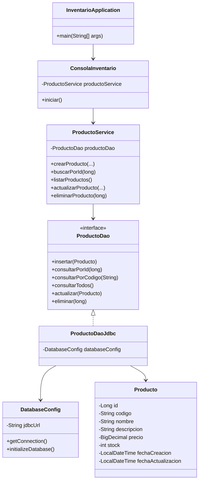

# Artefactos del ciclo de software

## 1. Alcance del módulo

El módulo permite administrar el catálogo y las existencias de productos de un pequeño negocio. El alcance incluye registrar, consultar, modificar y eliminar productos mediante una interfaz de consola conectada a SQLite por JDBC.

No forman parte de este incremento la autenticación, las ventas, las compras ni la gestión de proveedores.

## 2. Historias de usuario

### HU-01. Registrar producto

**Como** encargado de inventario, **quiero** registrar un producto con sus datos básicos **para** mantener actualizado el catálogo.

**Criterios de aceptación:**

- El código y el nombre son obligatorios.
- El código no puede repetirse.
- El precio y las existencias no pueden ser negativos.
- Al guardar, el sistema informa el identificador asignado.

### HU-02. Consultar productos

**Como** encargado de inventario, **quiero** consultar los productos registrados **para** conocer su información y existencias.

**Criterios de aceptación:**

- Se pueden listar todos los productos.
- Se puede buscar un producto por su identificador.
- Si no existe, el sistema muestra un mensaje comprensible.

### HU-03. Actualizar producto

**Como** encargado de inventario, **quiero** modificar un producto **para** corregir o actualizar sus datos.

**Criterios de aceptación:**

- Solo se actualizan productos existentes.
- Se aplican las mismas validaciones del registro.
- Se actualiza la fecha de modificación.

### HU-04. Eliminar producto

**Como** encargado de inventario, **quiero** eliminar un producto **para** retirar registros que ya no deben permanecer en el catálogo.

**Criterios de aceptación:**

- El sistema solicita confirmación.
- Solo se elimina un producto existente.
- El sistema informa el resultado de la operación.

## 3. Casos de uso

| Código | Caso de uso | Actor | Resultado esperado |
|---|---|---|---|
| CU-01 | Registrar producto | Encargado de inventario | Producto almacenado con identificador único |
| CU-02 | Listar productos | Encargado de inventario | Catálogo mostrado en pantalla |
| CU-03 | Buscar producto | Encargado de inventario | Datos del producto o aviso de inexistencia |
| CU-04 | Actualizar producto | Encargado de inventario | Datos modificados y fecha actualizada |
| CU-05 | Eliminar producto | Encargado de inventario | Registro eliminado después de confirmar |

## 4. Diagrama de clases

## 5. Modelo de datos

### Tabla `productos`

| Campo | Tipo | Restricción |
|---|---|---|
| id | INTEGER | Llave primaria autoincremental |
| codigo | TEXT | Obligatorio y único |
| nombre | TEXT | Obligatorio |
| descripcion | TEXT | Opcional |
| precio | NUMERIC | Obligatorio, mayor o igual a cero |
| stock | INTEGER | Obligatorio, mayor o igual a cero |
| fecha_creacion | TEXT | Obligatorio, formato ISO-8601 |
| fecha_actualizacion | TEXT | Obligatorio, formato ISO-8601 |

## 6. Diseño de arquitectura

La solución aplica una arquitectura por capas:

1. **Presentación:** captura opciones y datos desde la consola.
2. **Servicio:** contiene las reglas de negocio y validaciones.
3. **Acceso a datos:** encapsula las sentencias SQL y el mapeo de resultados.
4. **Configuración:** crea y entrega conexiones JDBC.
5. **Base de datos:** conserva la información en SQLite.

Se utilizan sentencias preparadas para separar los datos del SQL, cerrar automáticamente los recursos y reducir riesgos de inyección.

## 7. Estándares de codificación

- Paquetes escritos en minúscula y con dominio invertido: `co.edu.sena.inventario`.
- Clases e interfaces en PascalCase: `ProductoService`, `ProductoDao`.
- Métodos y variables en camelCase y con nombres descriptivos: `consultarPorId`, `fechaActualizacion`.
- Constantes en mayúscula sostenida: `DEFAULT_DATABASE_PATH`.
- Una responsabilidad principal por clase.
- SQL parametrizado mediante `PreparedStatement`.
- Recursos JDBC administrados con `try-with-resources`.
- Errores técnicos encapsulados en una excepción propia.

## 8. Plan de trabajo

| Fase | Actividad | Resultado |
|---|---|---|
| Análisis | Definir alcance, historias y reglas | Requisitos del módulo |
| Diseño | Modelar clases, datos y capas | Diseño técnico |
| Construcción | Implementar modelo, DAO, servicio e interfaz | Código fuente funcional |
| Pruebas | Automatizar CRUD y validaciones | Informe de ejecución Maven |
| Versionamiento | Crear repositorio y confirmaciones | Historial Git |
| Entrega | Documentar y comprimir | Archivo de evidencia |

## 9. Trazabilidad

| Historia | Caso de uso | Componente principal | Prueba |
|---|---|---|---|
| HU-01 | CU-01 | `ProductoService.crearProducto` | Registro y código duplicado |
| HU-02 | CU-02, CU-03 | `listarProductos`, `buscarPorId` | Consulta individual y listado |
| HU-03 | CU-04 | `actualizarProducto` | Actualización de campos |
| HU-04 | CU-05 | `eliminarProducto` | Eliminación y consulta posterior |

